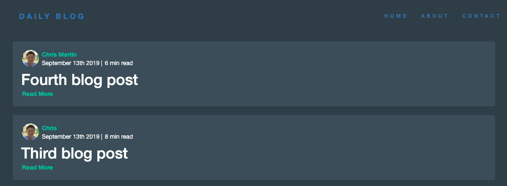
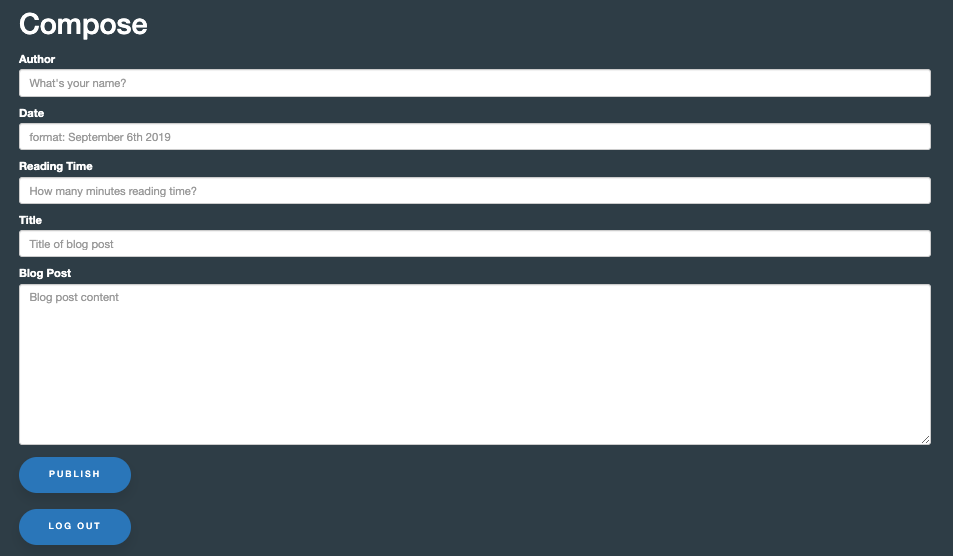
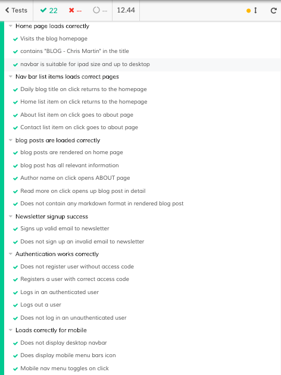

# Personal blog 

* The Frontend uses HTML, CSS, customized Bootstrap and Javascript.

* The Backend uses Node.js with Express and EJS for dynamic client-side templating. 

* Blog posts are written in Markdown and converted by the Showdown package to HTML before displaying.

* Blog posts are stored using MongoDB with MongoAtlas cloud. 

* Authentication for the “/compose” endpoint is handled by Passport.js along with cookies and sessions on the Backend.

* An API was created from scratch to interact with MailChimp's servers by using the NPM (request module). 

* End-to-end testing was handled by Cypress.

